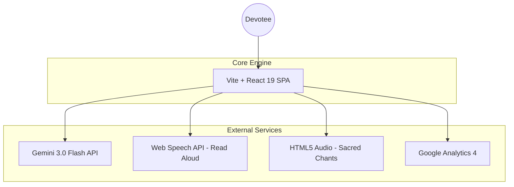

# ॐ KM Periyava Sannadhi: Digital Sanctuary Blueprint

[](https://reactjs.org/)
[](https://vitejs.dev/)
[](https://www.typescriptlang.org/)
[](https://tailwindcss.com/)
[](https://ai.google.dev/)
[](https://www.framer.com/motion/)

> **A high-fidelity digital portal for Sri Kanchi Maha Periyava Sannadhi, Kandhamangalam. Bridging ancient wisdom with cutting-edge AI architecture.**

---

## 🏛️ The Vision: Problem vs. Solution

### The Challenge
Traditional temple websites often suffer from static, non-engaging interfaces that fail to capture the spiritual "vibe" or provide real-time assistance to global devotees. Language barriers and lack of interactive teachings often distance the youth from sacred wisdom.

### The Blueprint Solution
**KM Periyava Sannadhi** is engineered as a **Digital Sanctuary**. It’s not just a website; it’s an immersive experience.
- **Bilingual Core**: Seamless real-time switching between Tamil and English.
- **AI Divine Assistant**: A context-aware chatbot powered by Gemini 3.0 for instant guidance on temple history and rituals.
- **Multisensory Engagement**: Integrated sacred chants, falling flower petals, and "Read Aloud" capabilities for divine teachings.

---

## 🧠 Intelligence & Architecture

The system follows a modern SPA (Single Page Application) architecture with a focus on **Performance** and **Immersive Design**.

### System Flow Diagram



### Key Technical Pillars
| Feature | Implementation |
| :--- | :--- |
| **AI Chatbot** | `GoogleGenAI` SDK integration with `gemini-3-flash-preview` for Satvic-toned responses. |
| **Animation Engine** | `motion/react` for fluid page transitions, scrolling lyrics, and interactive petals. |
| **Accessibility** | Web Speech API for "Read Aloud" teachings, ensuring inclusivity for all age groups. |
| **Performance** | Custom `LazyImage` component and Vite-optimized build pipeline for sub-second load times. |

---

## 🛠️ Setup & Installation

Follow these steps to deploy your own instance of the sanctuary.

### Prerequisites
- Node.js (v18+)
- NPM or Yarn
- A Google Gemini API Key

### 1. Clone & Install
```bash
git clone https://github.com/rahulcvwebsitehosting/km-periyava-sannadhi.git
cd km-periyava-sannadhi
npm install
```

### 2. Environment Configuration
Create a `.env` file in the root directory:
```env
VITE_GA_ID=G-SST437CJCD
GEMINI_API_KEY=your_gemini_api_key_here
```

### 3. Development & Build
```bash
# Start local development server
npm run dev

# Build for production
npm run build
```

---

## 🎨 UI Layout Blueprint

| Section | Design Philosophy |
| :--- | :--- |
| **Hero Section** | High-impact visual of Sri Kanchi Maha Periyava with a 3D tilt effect. |
| **Divine Controls** | Floating header controls for Music, Petals, and Language. |
| **Wisdom Portal** | Daily quotes with "Read Aloud" functionality and bilingual toggle. |
| **Chatbot** | Persistent floating action button (FAB) with an animated "Om" pulse. |

---

## 🤝 Connect & Collaborate

This project is maintained by **Rahul Shyam**. I am passionate about building high-performance, meaningful web applications.

[](https://linkedin.com/in/rahulshyamcivil)
[](https://github.com/rahulcvwebsitehosting)

---

<p align="center">
  <i>Jaya Jaya Shankara, Hara Hara Shankara</i><br>
  <b>© 2026 KM Periyava Sannadhi</b>
</p>
